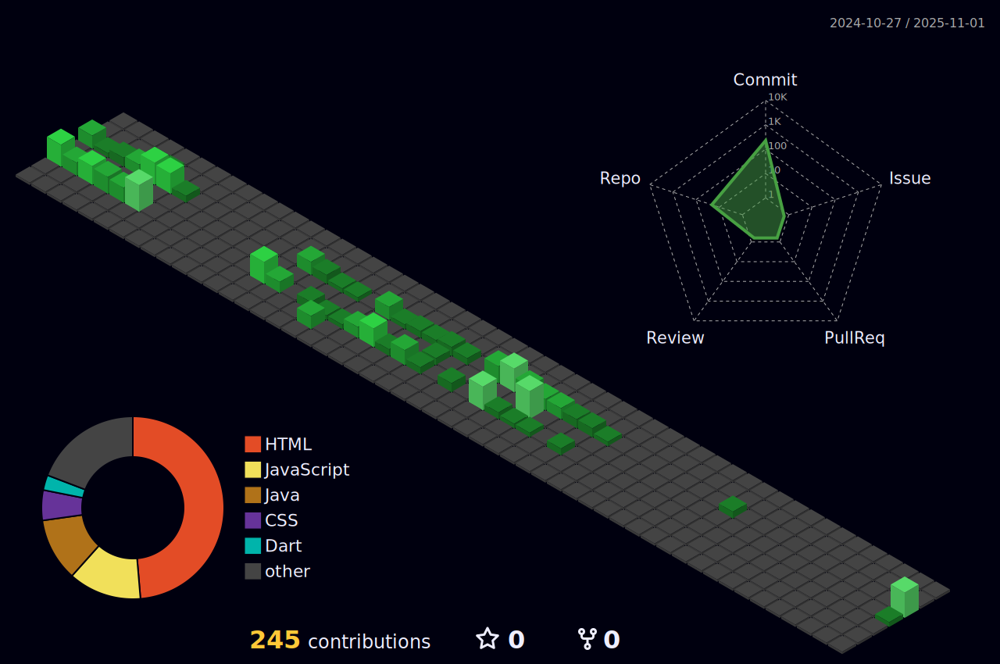

# 💜 Olá, eu sou o Miguel!

🎓 Estudante de **Análise e Desenvolvimento de Sistemas** na FACENS  
🎓 Técnico em **Desenvolvimento de Sistemas** pelo SENAI Sorocaba  

Sou apaixonado por tecnologia, desenvolvimento back-end e infraestrutura.  
Gosto de transformar problemas em soluções eficientes, organizadas e escaláveis.

Aqui no meu GitHub você encontrará projetos acadêmicos, APIs REST, estudos práticos e experimentos que fazem parte da minha evolução como desenvolvedor.

---

## 🚀 Tecnologias e Ferramentas

### 💻 Back-end
- Java  
- Spring Boot  
- Node.js  
- APIs REST  

### 🗄️ Banco de Dados
- MySQL  
- PostgreSQL  

### 🔧 Ferramentas
- Git & GitHub  
- Postman  
- Linux  
- VS Code  

---

## 💡 Áreas de Interesse

- Desenvolvimento de APIs RESTful  
- Arquitetura em camadas  
- Integração com banco de dados  
- Segurança em aplicações web  
- Redes e infraestrutura  

---

## 📊 Estatísticas GitHub

  

---

## 🚀 Minhas Skills

---

## 📦 Commits

